# Court Sense: Product Requirements

Version 0.4, September 2026. Owner: Jeremy. Working title "Court Sense" (rename freely).

**Status.** The court renderer, spaced-repetition scheduler, session UI, renderer
lab, offline support, GitHub sync and the content pipeline are built and tested
(52 JavaScript tests, 17 Python tests). No real content exists yet: the app runs
on a seven-card sample deck. The next step is the pilot (Phase 1): the first five episodes of Pickleball
Cheat Code, run by Claude Code with `/run-pilot`.

Read this document first, then `CLAUDE.md` for working conventions. Supporting
detail lives in `docs/`: `learning-design.md` (why the app works the way it does),
`rendering-notes.md` (court geometry and camera math), `sources.md` (podcasts and
speaker credentials) and `decisions.md` (architecture decisions with reasons).

## 1. Summary

Court Sense trains court reading for pickleball. In short batches, as many as you like on a given day, it shows a game situation from your own position on the court, asks what you would
do, reveals the answer on a top-down map, and schedules the lesson to come back
just before you would forget it. Later cards animate the lead-in shots, freeze
the moment before contact, and give you two or three seconds to choose, the way
tennis players are trained to read serves.

The lessons come from two podcasts in which touring and senior pros teach
strategy. Every card says who gave the advice, in which episode and at what
timestamp, and whether a pro said it or stood behind it. Advice without pro
backing never reaches the deck.

It runs as an installable web app on the phone for daily use and on the laptop
when a bigger picture helps.

## 2. Goals and non-goals

The app succeeds if it does these things:

| Id | Goal |
|---|---|
| G1 | Build court-reading judgment: recognize common situations and pick the right shot quickly. |
| G2 | Teach only trustworthy advice: pro-sourced under the endorsement rules in section 4, with provenance on every card. |
| G3 | Fit a short daily habit on a phone without capping how much you do, and use the extra space well on a laptop. |
| G4 | Make lessons stick through retrieval practice and spaced repetition (FSRS). |
| G5 | Carry lessons onto the court: short external-focus cues, and a closing "take this to the court" cue each session. |
| G6 | Keep podcast-derived content and progress private, and publish nothing copyrighted. |

Out of scope: accounts or a server backend, social features, analysis of your own
match video, redistribution of podcast audio or transcripts, a general pickleball
encyclopedia, and app-store builds (the installable web app covers the need).

## 3. User

One user: Jeremy, a 4.0 recreational player who wants to reach the next level,
wants a short daily habit (more when he feels like it), and is comfortable with git, the command line and
Claude Code. Phone for daily sessions; laptop sometimes, mainly to see the court
pictures larger. Content production happens in Claude Code sessions on a machine
with a GPU if one is available.

## 4. Content sources and trust rules

### 4.1 Sources

| Show | Pros on the show | Notes |
|---|---|---|
| 4.0 to Pro | Mircea Morariu (senior pro), earlier Scott Fliegelman (senior pro) | Host Michael O'Neal is treated as a non-pro by default (open question Q1). |
| Pickleball Cheat Code | Tanner Tomassi (touring pro), CRBN pro guests | Co-host Brodie Smith is a high-level coach. Kevin Tsati is a provisional pro (Q2). |

Credentials, feeds and verification dates are in `docs/sources.md` and
`pipeline/config/speakers.yaml`.

### 4.2 Who counts as a pro

Each speaker has a tier: `touring_pro`, `senior_pro`, `elite_coach`,
`advanced_amateur`, `host` or `unknown`. By default the pro tiers are
`touring_pro` and `senior_pro` (`deck.pro_tiers` in `pipeline/config/piq.yaml`).

A seventh tier, `provisional_pro`, covers players whose level is unverified but
whose advice is wanted (currently Kevin Tsati). Their own advice counts as pro
advice unless any full pro's advice or endorsement contradicts it, in which case
it is struck. They cannot endorse other speakers (`deck.provisional_pro_tiers`).

### 4.3 Endorsement rules

Every extracted tip gets one status. The deck admits the first four by default.

| Status | Meaning | In the deck |
|---|---|---|
| `pro_stated` | A pro said it. | Yes |
| `endorsed_explicit` | A non-pro said it and a pro agreed out loud. | Yes |
| `endorsed_implicit` | A non-pro said it; a pro took part in the same discussion (within about three minutes, same topic) and did not object. | Yes (configurable) |
| `qualified` | A pro agreed with a condition; the condition is kept. | Yes, with conditions |
| `refuted` | A pro disagreed, including soft pushback ("I'd push back a little", "not necessarily"). The pro's correction becomes its own tip; the refuted claim is kept only as a wrong answer choice. | Only as a distractor |
| `no_pro_present` | A non-pro said it with no pro in the discussion. | No |

Partial disagreement splits a claim: the accepted part keeps its endorsement, the
rejected part is refuted. Ambiguous cases take the more conservative status and
go to human review. A pro contradicting a non-pro-backed principle in a later
episode strikes it (section 6, P-9). Two pros disagreeing is a tension, not a
refutation: both principles stay, linked, with their conditions.

To tighten the deck to spoken agreement only, remove `endorsed_implicit` from
`deck.allowed_endorsements`; rebuilding the deck applies it retroactively.

### 4.4 Faithfulness

Tips are paraphrased, never long quotes. A reason (`why`) appears only if a
speaker gave one. Claude's own observations live in a separate `claude_note`
field that the app labels "Claude's note", so they are never mistaken for a
pro's words. Scene coordinates are nearly always estimated and are flagged as
inferred.

### 4.5 Copyright and privacy

Audio, transcripts, extracted tips and the deck stay in a private repository
(section 9). The public repository holds code, schemas, prompts and a sample deck
of illustrative content (two of its sample principles paraphrase public episode
descriptions and are labeled as such). Nothing from the podcasts is ever committed to
the public repository.

## 5. System overview

```mermaid
flowchart LR
  subgraph Pipeline [Content pipeline: this repo + Claude Code]
    A[RSS feeds] --> B[Audio]
    B --> C[WhisperX transcript with speakers]
    C --> D[Speaker map - Claude]
    D --> E[Prepared transcript]
    E --> F[Raw tips - Claude]
    F --> G[Review - Jeremy]
    G --> H[Principles - Claude]
    H --> I[Cards and scenes - Claude]
    I --> J[validate + build-deck]
  end
  J --> K[(Private data repo: deck/deck.json)]
  K <--> L[App on GitHub Pages: phone and laptop]
  L <--> M[(Private data repo: progress/device.json)]
```



Code repository layout:

```
app/                 the web app (no build step; served as-is)
  src/court/         deterministic renderer: geometry, camera, trajectory, views, playback
  src/srs/           FSRS scheduler wrapper and aid-fading stages
  src/store/         progress, settings, GitHub sync
  src/ui/            card view, session, views, renderer lab
  data/              sample deck (illustrative content only)
  vendor/, fonts/    ts-fsrs 5.4.2 (MIT), Barlow (OFL), self-hosted
schemas/             JSON Schemas for every file the pipeline and app exchange
pipeline/            piq.py CLI, config, tests
prompts/             rulebooks for each Claude step
.claude/skills/      Claude Code skills that wrap the prompts
tools/               scene checker, reference renders, service-worker manifest
tests/               node --test suites (renderer, scheduler, progress, sync, UI)
docs/                this PRD and supporting notes
```

## 6. Pipeline requirements

| Id | Requirement | Status |
|---|---|---|
| P-1 | Resolve feeds from the iTunes lookup or a pinned RSS URL; write episode manifests with stable ids `{show}-{YYYYMMDD}-{sha1(guid)[:6]}`. | Built |
| P-2 | Download audio politely (pause between files, resumable `.part` files), never into git. | Built |
| P-3 | Transcribe with WhisperX large-v3, diarization, and a vocabulary prompt for pickleball terms and names. Dry-run mode masks the Hugging Face token. | Built, untested against real audio |
| P-4 | Map diarization labels to registry ids with cited evidence; unknown speakers stay unknown; new people are proposed, not added. | Prompt and skill written |
| P-5 | Prepare a condensed transcript: speaker turns with a timestamp at least every 45 seconds, a speaker legend marking who counts as a pro, and show notes. | Built |
| P-6 | Extract raw tips per the rules in section 4, one JSONL file per episode, validated with cross-checks (endorser must be a pro, id prefixes, known speakers). | Prompt, skill and validator written |
| P-7 | Queue tips flagged `needs_review`; record approve, reject or edit decisions with notes in an append-only log. | Built (CLI + skill) |
| P-8 | Merge reviewed tips into principles with all sources, conditions, common mistakes, distractor candidates and a priority score favoring advice repeated by several pros. | Prompt and skill written |
| P-9 | Strike non-pro-backed principles a pro contradicts anywhere in the corpus; link pro-versus-pro disagreements with `tension_with`. | In the merge prompt |
| P-10 | Generate cards from each principle's content with no target count: one court card per distinct situation the sources describe, plus a card for each stated reason, form cue, named mistake and drill detail. Court cards get scenes that follow the formation and height tables. | Prompt and skill written |
| P-11 | Check scenes semantically (sides of the net, clearances, timeline chains) beyond JSON Schema. | Built (`tools/check-scenes.mjs`) |
| P-12 | Build the deck: only active principles with allowed endorsements, their cards and referenced scenes, display names for speakers, shows and episodes, and a content hash. Warn when filters leave it empty. | Built |

Pilot pass criterion: in a spot-check of at least ten tips against the audio,
attribution and endorsement labels are right at least nine times in ten.

## 7. Data model

All exchanged files have schemas in `schemas/` (JSON Schema 2020-12) and carry
`schema_version: 1`.

A **raw tip** is one piece of advice from one speaker at one timestamp, with its
endorsement and review flags. A **principle** is one teaching point merged from
many tips, carrying every source, conditions, mistakes, distractor candidates, a
status (`active`, `struck`, `draft`) and a priority. A **scene** is a frozen court
moment: four players with handedness, the ball's origin and current position with
net clearance, an optional answer overlay, a camera, and for timed cards a
timeline of shots with a freeze point and response window. A **card** is one
question about a principle, optionally drawing a scene. The **deck** bundles
principles, scenes and cards with display names. **Progress** is one file per
device: current FSRS state per card plus an append-only review log.

Ids: tips `<episode_id>-tNNN`, principles `p-<slug>`, scenes `s-<slug>`, cards
`c-<slug>-<n>`. Ids never change once published, because progress refers to them.
Any breaking schema change bumps `schema_version` and ships a migration in the
same commit.

## 8. App requirements

### 8.1 Sessions

Sessions are open-ended: nothing caps how many cards you do in a day. Cards come
in batches, and each batch ends with a summary and a Keep going button.

| Id | Requirement | Status |
|---|---|---|
| A-1 | Plan each batch: overdue reviews first (most overdue first), learning cards that fall due within twenty minutes, and a new card after every three reviews. | Built |
| A-2 | Order new cards so principles not yet seen today come first, one variant of every principle comes before any second variant, then by priority. Two cards of one principle are never adjacent when it can be avoided. | Built |
| A-3 | No daily limit on new cards and no session length by default. An optional new-card limit in Settings is the release valve if reviews pile up; due reviews always come first. | Built |
| A-4 | End each batch (default ten cards, adjustable) with a summary: cards, court reads right, minutes, one focus cue for the court, a drill to try when a missed principle has one, and Keep going. Once nothing is due and every card has been seen, Keep going offers practice ahead: the cards due soonest, recorded as reviews. | Built |
| A-5 | Missed cards come back in the same batch (at most twice), and in the next batch when they fall due. | Built |
| A-6 | Save progress after every rating. An answer given but not rated (the app closed first) is recorded with its suggested rating at the next start. | Built |
| A-7 | Suggest a rating from correctness and response time; the user can override it. Each rating button shows the resulting interval. | Built |
| A-8 | Batch size, the optional new-card limit, the longest review gap (default 365 days), camera mode, how much help mature cards keep, and how much time to choose on timed cards (a multiplier on the clock only) are settings. | Built |
| A-9 | Court cards marked mirrorable alternate between the authored picture and its mirror image (positions flipped left to right, handedness swapped) on successive reviews, starting as authored. The reveal says when a card was mirrored, and the review log records it. | Built |
| A-10 | Choice cards draw from an option pool: each showing displays one phrasing of the correct play and up to three wrong answers. The correct choice takes every position once in each run of showings, correct phrasings take turns, and wrong answers rotate so consecutive showings share exactly one. The log records what was on screen. | Built |

With the scheduler's defaults, a card answered correctly every time comes back
after about 10 minutes, then 2 days, 11 days, 46 days and 163 days, and then
yearly, the longest-gap setting. A miss brings it back within minutes and
restarts growth from a shorter interval (about 5, 12 and 28 days after a miss
at the five-month mark).

### 8.2 Card types

| Type | What happens |
|---|---|
| `scenario_mc` | A court picture and three or four choices. The answer appears on the court and on a top-down map. |
| `timed_decision` | Lead-in shots play, the picture freezes before contact, and the choices unlock with a draining clock. The question and choices can be read before Play with no time limit; the clock covers only choosing. Running out counts as a miss. |
| `text_mc` | Three or four choices without a court picture, for form fixes and rules of thumb. |
| `why` | Recall the reason behind a principle, then show the answer and self-rate. |
| `form_cue` | Recall the cue for a stroke or movement, then self-rate. |
| `drill_recall` | Recall a drill's setup and goal, then self-rate. |

After every answer the card shows the explanation, the focus cue, the sources in
plain words ("Mircea Morariu (senior pro). 4.0 to Pro, "…", at 00:14:32."), any
Claude's note, a replay button, and the rating buttons.

### 8.3 Court rendering

Scenes are data; the renderer draws them the same way every time
(`docs/rendering-notes.md`). The main view is from your position. The default
camera sits just over your shoulder (2.3 ft to the side away from your paddle,
2.7 ft back, 0.4 ft up) because a shot coming straight at your eyes collapses
into a line in a true first-person view; true first person is a setting.

Aids that make the flight readable: the path dashed on their side of the net and
solid on yours, a shadow on the court, a dashed stalk from ball to shadow, and a
tick on the stalk at net height so above-net and below-net balls are unmistakable.
Players are upright figures with paddles on the correct side; the top-down and
mini-map views label backhands and show your camera's field of view as a wedge.
The answer overlay (target zone, shot path, player moves) stays hidden until you answer. A mirrored card is an exact reflection of its scene, camera included, so it is the same situation seen from the other side of the court; only cards whose text names no side are mirrored. Reference renders of the sample scenes are in `docs/img/` (`npm run renders`).

### 8.4 Aid fading

The court picture is there at every stage. What fades are the drawn helpers a
real match does not have: the painted flight path, the height stick with its
net-height tick, and the top-down map. Practicing with a cue that is missing in
play makes the read depend on it, so mature cards pose the question the way the
court does. After every answer, at every stage, all the aids return to show what
happened (`STAGES` in `app/src/srs/scheduler.js`):

| Stage | When | While deciding | Clock on timed cards | Playback speed | Freeze |
|---|---|---|---|---|---|
| A | New, learning or relearning | Your view plus a top-down map; path, shadow, stalk | None | 0.6x | As authored |
| B | In review, under 21 days | Your view plus the mini-map; all aids | Window x 1.33 | 0.85x | 120 ms earlier |
| C | Mature (21 days or more) | Your view with the ball's shadow | Window x 0.85 | 1x | 250 ms earlier |

The earlier freeze (T-2) shows less of the last shot's flight, never less than
150 ms of it, so the read has to come from earlier information. It never moves
the clock: the question and the choices are read before Play with no limit, the
choices keep their positions, and the clock starts at the freeze (Q5). The
"Time to choose" setting stretches that clock for a slower search among the
choices; the suggested rating keeps the card's own window, so the stretch never
inflates ratings.

The shadow stays because a flat screen lacks the depth cues two eyes give on
court. The "On mature cards" setting can keep the mini-map or every aid instead;
real speed and the shorter window apply either way.

### 8.5 Layouts

| | Phone (under 900 px wide) | Laptop (900 px and wider) |
|---|---|---|
| Court view | Full width, 360 x 380 viewBox | Left column (three fifths), 800 x 500 viewBox, sticky while scrolling |
| Top-down | Inset mini-map in the corner; full top-down (cropped to the action) below the court after answering; a toggle swaps the main view in stage A and after answering | Side panel above the question |
| Choices and ratings | Large touch targets; ratings stick to the bottom of the screen | Right column |

### 8.6 Keyboard (laptop)

| Key | Action |
|---|---|
| 1 to 4 | Choose an option; after answering, rate Again, Hard, Good or Easy |
| Enter or Space | Play a timed card, show an answer, or accept the suggested rating |
| R | Replay the shot |

### 8.7 Offline and install

The app installs to the home screen (web manifest, icons including maskable and
Apple touch icons). A service worker caches the app shell and refreshes it in the
background; `npm run sw` regenerates its file list and cache version after any
change under `app/`. The last deck loaded is kept on the device, so sessions work
offline, and progress is saved locally after every card. Safari may clear storage
for sites that are not installed and not visited for a while, so install the app
and keep sync on.

### 8.8 Accessibility

Color is never the only signal (the correct choice is also marked, verdicts are
text). Buttons are real buttons, the answer area is announced to screen readers,
and every view works with the keyboard. With the system's reduced-motion setting,
timed cards skip the animation and freeze at once, which removes the timing
challenge (open question Q6).

### 8.9 Renderer lab

`lab.html` renders any scene from both cameras with phone and laptop sizes, every
aid toggle, top-down, mini-map and side views, answer reveal, a time scrubber,
playback at three speeds, scene checks, a readout of ball height against net
height, a paste box for scene JSON and SVG download. Claude Code and Jeremy use it
to check generated scenes before they ship.

### 8.10 Content mix

Card counts follow the content: each principle gets one card per distinct
testable point in its sources (situations, reasons, form cues, named mistakes,
drill details), with no target per principle or per episode. The card types
cover strategy (court decisions and timed reads), form (cue recall and "fix the
mistake" choices) and drills (recall cards, also suggested in the batch summary
right after you miss a principle the drill trains). The podcasts are mostly
strategy talk, so strategy will probably lead; `build-deck` prints the actual
mix. Form is taught as the pros' verbal cues and named mistakes; the court
figures show positions and ball flight, not stroke mechanics.

## 9. Sync, hosting and privacy

The app shell is public on GitHub Pages; it contains no podcast content. The
deck and progress live in a **private** data repository that the app reads and
writes through the GitHub contents API with a fine-grained personal access token:
only that one repository, Contents read and write, with an expiry date and a
reminder to rotate it. The token is stored only in the browser.

Each device writes its own file (`progress/<device_id>.json`), so two devices never
edit the same file. A sync reads every device's file, merges them (review logs
are unioned; where both devices reviewed a card, its state is rebuilt by
replaying the combined log through FSRS), writes this device's file, and pulls
the deck. Sync runs when the app opens and after each session, and on demand in
Settings. Resetting progress is local only; delete the files in the data repo to
reset everywhere.

Threats worth knowing about. Any script running on the app's origin can read the
token, so the app loads nothing from third parties (fonts and libraries are
self-hosted) and ships a Content-Security-Policy that restricts scripts to its
own origin and network calls to `api.github.com`. Browser storage is shared by
origin, not by path, and every Pages project site under one account is served
from the same origin, `<user>.github.io`. Because the account already hosts
another Pages project (Q7), Court Sense gets its own origin: a free GitHub
organization owns the public app repository, so the app is served from
`<org>.github.io` and shares storage with nothing else. The private data
repository stays under the personal account, where the token is scoped to it
alone. A custom subdomain would also work, but if the personal account's user
site has a custom domain, its project sites are served under that domain too.

## 10. Phases

**Phase 0, renderer harness: done.** Deterministic scene renderer with both
cameras, aids, top-down and mini-map views, reference renders and tests.

**Phase 1, pilot pipeline: next.** The first five episodes of Pickleball Cheat
Code, end to end, run by Claude Code with the `/run-pilot` skill. Jeremy's part is
one-time setup (a Hugging Face token and model terms, the private data repo),
decisions on flagged tips (or accepting Claude's recommendations), and a
listening spot-check of ten short clips prepared by `piq.py spotcheck`. Exit when
the spot-check passes (9 of 10) and the cards look right in the lab.

**Phase 2, app MVP: built.** Remaining: use it daily on an iPhone (Safari and
installed) and in laptop Chrome, and fix whatever real use reveals.

**Phase 3, sync: built, tested against a fake.** Remaining: a real private repo,
two devices, a deliberate same-card review on both, and a token-expiry drill.

**Phase 4, full corpus.** Run all episodes (about 120, roughly 70 hours of audio)
with the headless loop, review the queue in batches, merge and generate.

**Phase 5, animation and occlusion training: foundations built.** The idea comes
from temporal occlusion research in racket sports: players who practice reading
an opponent's shot from video cut off before contact learn to anticipate
earlier (Farrow and Abernethy 2002 used this to train tennis players to read
serves; see `docs/learning-design.md`). Built: timeline scenes with chained
shots, bounces and player movement; freeze before contact; options locked until
the freeze; a draining response clock (two to three seconds, scaled by maturity);
timeouts counted as misses; response time feeding the suggested rating; speed
ramping from 0.6x to real speed. Still to build:

| Id | Requirement |
|---|---|
| T-1 | "Read the shot" cards that ask what the opponent is about to hit or where the ball will land, separate from "choose your response" cards. |
| T-2 | Earlier freeze points as a card matures (less ball flight shown means harder reading). Built: stages B and C freeze 120 and 250 ms earlier than authored (section 8.4, D21). |
| T-3 | A drag model for ball flight (pickleballs slow sharply), behind the existing arc interface. |
| T-4 | Opponent cues (paddle face, backswing size, body position) only where a pro names them as tells. |
| T-5 | Response-time trends per topic, to show whether reads are getting faster. |
| T-6 | Two- and three-shot sequences (a dink rally ending in a pop-up) for the kitchen-battle principles. |

**Phase 6, extras.** A stats view (retention, weak topics), suspend and edit from the card browser,  links from sources to the episode audio at the timestamp, a
weak-topic practice mode, and possibly sharing a deck with a partner.

## 11. Acceptance criteria for the MVP

| Id | Criterion | Status |
|---|---|---|
| AC-1 | `npm test` and `python -m unittest discover -s pipeline/tests` pass. | Passing |
| AC-2 | A full session on the sample deck runs to the summary on a phone and on a laptop, entirely by touch or entirely by keyboard. | Passing in jsdom; confirm on real devices |
| AC-3 | Timed cards lock choices until the freeze, show the clock, and record a timeout as a miss with a suggested Again. | Passing in jsdom; confirm on devices |
| AC-4 | The app loads and runs a session with the network off after one online visit. | To verify on devices |
| AC-5 | With a real private repo, reviews made on the phone appear on the laptop after sync and vice versa, including one card reviewed on both. | To verify |
| AC-6 | The pilot deck's cards show correct provenance, and no card cites a speaker without an allowed endorsement. | After Phase 1 |
| AC-7 | Every pilot scene passes `tools/check-scenes.mjs` with no errors and looks right in the lab from both cameras. | After Phase 1 |
| AC-8 | Closing the app after answering but before rating records the answer at the next start. | Passing in tests |
| AC-9 | Batches continue with no cap; practice ahead appears once everything has been seen. | Passing in tests |
| AC-10 | A mirrored scene renders as the exact mirror image of the original and passes the same scene checks. | Passing in tests |
| AC-11 | No choice card keeps its correct answer in one position, and cards with more than three wrong answers change their choices between consecutive showings. | Passing in tests |

## 12. Decisions on the open questions

Decided by Jeremy in September 2026.

| Id | Question | Decision |
|---|---|---|
| Q1 | Does Michael O'Neal count as a pro? | No. His tips need a pro's endorsement. |
| Q2 | How should Kevin Tsati's advice be treated? | It counts, unless any pro's advice or endorsement contradicts it, in which case it is struck. He cannot endorse others. Implemented as the `provisional_pro` tier. |
| Q3 | Keep implicit endorsements? | Yes. One config line drops them later. |
| Q4 | Limit new cards per day or session length? | No limits. Open-ended batches with Keep going; an optional limit exists in Settings but is off. |
| Q5 | Is a three-second response window right? | Yes, provided reading is not rushed: the question and choices are readable before Play with no time limit, the clock starts at the freeze, and timed choices stay under 60 characters. New cards have no clock. |
| Q6 | Animate timed cards despite reduced motion? | No. Respect the system setting. |
| Q7 | Isolate the token from other Pages sites? | Yes, another Pages project exists. Serve the app from its own GitHub organization. |
| Q8 | Allow principles sourced only from episode descriptions? | No. |

## 13. Risks

| Risk | Mitigation |
|---|---|
| Diarization errors misattribute a host's words to a pro. | Speaker maps cite evidence, low confidence goes to review, the pilot spot-check gates scale-up. |
| Claude mislabels an endorsement. | Conservative defaults, validator cross-checks, review queue, provenance with timestamps on every card. |
| Scenes misplace players or heights. | Formation and height tables, the scene checker, the lab, and `inferred` flags. |
| Aids become a crutch. | Stage fading down to no path and no map at maturity. |
| Token exposure. | Single-repo fine-grained token with expiry, no third-party scripts, CSP, shared-origin warning. |
| Browser storage cleared on iOS. | Install to the home screen, sync after each session, export as a manual backup. |
| Copyright. | Private data repo, paraphrase only, no audio or transcripts published. |
| The app teaches outdated or level-inappropriate advice. | Level and condition fields, pro repetition in priority, Jeremy's review. |

## 14. Working with Claude Code

Start a session in this repository and say:

> Read docs/PRD.md and CLAUDE.md. Run npm install, npm test and the pipeline
> tests. Then run /run-pilot cheatcode 5.

For app work: "Serve the app, open it at phone and laptop widths, and fix
anything that looks wrong," or pick a requirement id from this document. The
skills (`/run-pilot`, `/map-speakers`, `/extract-episode`, `/review-queue`,
`/merge-principles`, `/generate-cards`) carry the content work.
